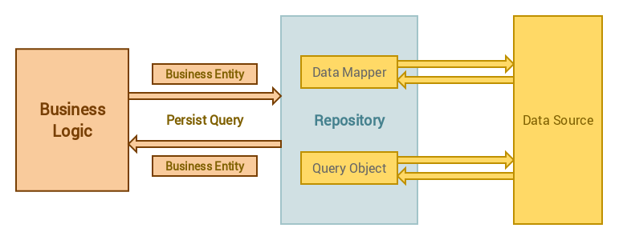

### 模式实现业务逻辑和数据访问的分离

### 插件介绍

首先需要声明的是设计模式和使用的框架以及语言是无关的，关键是要理解设计模式背后的原则，这样才能不管你用的是什么技术，都能够在实践中实现相应的设计模式。

按照最初提出者的介绍，Repository 是衔接数据映射层和领域层之间的一个纽带，作用相当于一个在内存中的域对象集合。客户端对象把查询的一些实体进行组合，并把它 们提交给 Repository。对象能够从 Repository 中移除或者添加，就好比这些对象在一个 Collection 对象上进行数据操作，同时映射层的代码会对应的从数据库中取出相应的数据。

从概念上讲，Repository 是把一个数据存储区的数据给封装成对象的集合并提供了对这些集合的操作。

Repository 模式将业务逻辑和数据访问分离开，两者之间通过 Repository 接口进行通信，通俗点说，可以把 Repository 看做仓库管理员，我们要从仓库取东西（业务逻辑），只需要找管理员要就是了（Repository），不需要自己去找（数据访问），具体流程如下图所示：



### 配置

#### 添加服务提供商

将下面这行添加至 config/app.php 文件 providers 数组中：

```php
'providers' => [
  ...
  App\Plugins\Auth\Providers\LaravelServiceProvider::class
 ]
```

### 创建 Repository

#### 不使用缓存
```
php artisan make:repo User
```

#### 使用缓存
```php
php artisan make:repo User --cache
```


> 创建 UserRepository 时会询问是否创建Model ，如果Model以存在，需要把 App\Repositories\Modules\User\Provider::class 的Model替换成当前使用的Model

### 配置Providers

将下面这行添加至 App\Providers\AppServiceProvider::class 文件 register 方法中：

```php
public function register()
{
    $this->app->register(\App\Repositories\Modules\User\Provider::class);
}
```

### 使用

```php
<?php
namespace App\Http\Controllers;

use App\Http\Controllers\Controller;
use Illuminate\Http\Request;

class HomeController extends Controller
{

    protected $repo = null;

    public function __construct(Interfaces $repo)
    {
        $this->repo = $repo;
    }

    public function index(Request $request){
        return $this->respondWithSuccess($this->repo->get(['*']));
    }
}
```

> 配合 [Search](./search.md) 更灵活

```php
public function index(Request $request){
        return $this->respondWithSuccess(
            $this->repo->getwhere(
                new IndexSearch($request->olny(['name'])) ,
                ['*']
            )
        );
    }
```

### 方法
| 方法名 | 参数 | 说明 |
| --- | --- | --- |
| getModel | 无|
| newModel | 无| 
| getTable | 无| 
| find | id:主键, $columns 要获取的列|
| findMany | id:主键集, $columns 要获取的列| 
| findWhere | attributes:where条件, $columns 要获取的列| 
| findValue | attributes:where条件, $columns 要获取的列|
| get | $columns 要获取的列| 
| getWhere | attributes:where条件, $columns 要获取的列| 
| chunkById | $columns 要获取的列， $count 每次获取多少条，$callback 回调处理，$column 不知道 怎么用文字表达， $alias 不知道 怎么用文字表达 | 
| firstOrCreate | $attributes:where条件，$values 附加参数| 
| updateOrCreate | $attributes:where条件，$values 附加参数|
| paginate | $attributes:where条件，$perPage 每页显示N条，$columns 要获取的列， $pageName 页码key,  $page 当前页码| 
| simplePaginate | $attributes:where条件，$perPage 每页显示N条，$columns 要获取的列， $pageName 页码key,  $page 当前页码| 
| limit | $attributes:where条件，$perPage 每页显示N条，$columns 要获取的列| 
| create| $attributes: create数据| 
| update | $model: Model, $values 要更改的数据，array $attributes where条件 | 
| updateWhere | array $values 要更改的数据 $attributes where条件 |
|  delete | $model Model | 
|  deleteWhere | $attributes where条件 | 
|  with | $with 渴求式加载 | 
|  make | $with 渴求式加载 |
|  scope | $scope 查询作用域 | 
|  join | $relations 要关联的模型 | 

